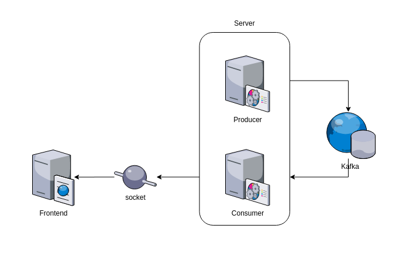

# Spring Boot reactive and Kafka

Project using Spring Boot, having a producer and consumer for Kafka, and socket exposed.

# Running Kafka
[Confluent Platform Quick Start (Docker)](https://docs.confluent.io/current/quickstart/ce-docker-quickstart.html#getting-started-with-docker-compose)

# References
* [Angular + Spring Boot + Kafka: How to stream realtime data the reactive way.](https://medium.com/swlh/angular-spring-boot-kafka-how-to-stream-realtime-data-the-reactive-way-510a0f1e5881)
* [Kafka no Spring Boot](https://emmanuelneri.com.br/2019/06/04/kafka-no-spring-boot/)
* [The Magic of Kafka With Spring Boot](https://dzone.com/articles/magic-of-kafka-with-spring-boot)
* [Apache Kafka — Aprendendo na prática](https://medium.com/trainingcenter/apache-kafka-codifica%C3%A7%C3%A3o-na-pratica-9c6a4142a08f)
* [How to Work with Apache Kafka in Your Spring Boot Application](https://www.confluent.io/blog/apache-kafka-spring-boot-application/#two)
